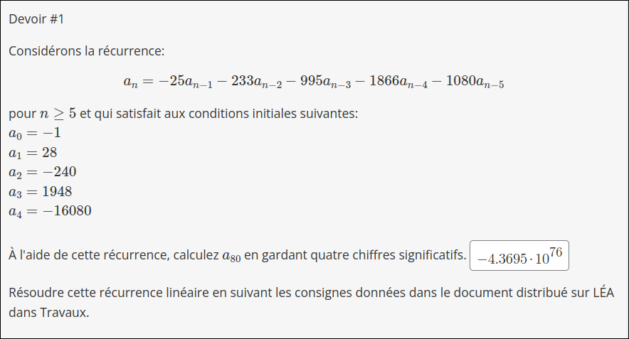

## Laboratoire de récurrence

### Étape 1


### Étape 2

Code en C.
Compilé avec `gcc -O3 main.c`
```c
#include <stdlib.h>
#include <stdio.h>
#include <stdint.h>
#include <time.h>
#include <stdbool.h>

typedef struct {
  bool calc;
  double r;
} Node;

/**
 * Cacher les calculs precedants pour optimiser.
**/
Node CACHE[10000];
double recurse_suite(uint32_t a);
double direct_suite(uint32_t a);

// Asumer que les arguments sont valide:
// arg 1 = a. : un entier.
int main(int argc, char** argv) {
  //Netoyer le cache.
  for (int i = 0; i < 10000; i++) {
    CACHE[i].calc = false;
    CACHE[i].r = 0.0;
  }

  // Definition des valeurs de depart
  const double CONST_POW[] = {-1, 28, -240, 1948, -16080};
  for (int i = 0; i < 5; i++) {
    CACHE[i].calc = true;
    CACHE[i].r = CONST_POW[i];
  }

  int a;
  sscanf(argv[1], "%d", &a);

  clock_t start, end;
  double time_spent;
  start = clock();
  double res = recurse_suite(a);
  end = clock();
  time_spent = (double)(end - start) / CLOCKS_PER_SEC;
  printf("Result: %.4e\n", res);
  printf("Time spent: %f µs\n", time_spent*1000000);
  return 0;
}

// Definition de la fonction recursive
const double CONST_FACT[] = {-25, -233, -995, -1866, -1080};
double recurse_suite(uint32_t a) {
  if (CACHE[a].calc) return CACHE[a].r;
  else {
    double n[5];
    double result = 0.0;
    for (int i = 0; i < 5; i++) {
      if (CACHE[a-i-1].calc)
        n[i] = CACHE[a-i-1].r;
      else
        n[i] = recurse_suite(a-i-1);
      n[i] *= CONST_FACT[i];
      result += n[i];
    }
    CACHE[a].calc = true;
    CACHE[a].r = result;
    return result;
  }
}
```
Console:
```
> ./a.out 80
Result: -4.3695e+76
Time spent: 3.000000 µs

```

### Étape 4: Résolution:
$$
a_n = -25*a_{n-1} - 233*a_{n-2} - 995*a_{n-3} - 1866*a_{n-4} - 1080*a_{n-5} \\
a_n = r^n \\
0 = r^n + 25*r^{n-1} + 233*r^{n-2} + 995*r^{n-3} + 1866*r^{n-4} + 1080*r^{n-5} \\
0 = r^{n-5} (r^5 + 25*r^4 + 233*r^3 + 995*r^2 + 1866*r + 1080)
$$
Factorisation par [SymboLab](https://www.symbolab.com/solver/step-by-step/x%5E%7B5%7D%2B25x%5E%7B4%7D%2B233x%5E%7B3%7D%2B995x%5E%7B2%7D%2B1866x%2B1080?or=input)
$$
0 = r^{n-5} (x+1) (x+4) (x+5) (x+6) (x+9) \\
a_n = c_1*-1^n + c_2*-4^n + c_3*-5^n + c_4*-6^n + c_5*-9^n \\
a_0 = -1 = c_1 + c_2 + c_3 + c_4 + c_5 \\
a_1 = 28 = c_1 * -1 + c_2 * -4 + c_3 * -5 + c_4 * -6 + c_5 * -9 \\
a_2 = -240 = c_1 * 1 + c_2 * 16 + c_3 * 25 + c_4 * 36 + c_5 * 89 \\
a_3 = 1948 = c_1 * -1 + c_2 * -64 + c_3 * -125 + c_4 * -216 + c_5 * -729 \\
a_4 = -16080 = c_1 * 1 + c_2 * 256 + c_3 * 625 + c_4 * 1296 + c_5 * 6561 \\
$$
Résoudre avec Gauss.
$$
\begin{bmatrix}
1 & 1 & 1 & 1 & 1 & ¦ &  -1 \\
-1 & -4 & -5 & -6 & -9 & ¦ & 28 \\
1 & 16 & 25 & 36 & 89 & ¦ & -240 \\
-1 & -64 & -125 & -216& -729 & ¦ & 1948 \\
1 & 256 & 625 & 1296 & 6561 & ¦ & -16080 \\
\end{bmatrix}
$$
Beaucoup trop de math plus tard...
$$
c_1 = \frac{740}{149}\\
c_2 = \frac{-7814}{149}\\
c_3 = \frac{12631}{149}\\
c_4 = \frac{-4106}{149}\\
c_5 = \frac{-120}{149} \\
$$
Solution:
$$
a_n = \frac{740}{149}*-1^n + \frac{-7814}{149}*-4^n + \frac{12631}{149}*-5^n + \frac{-4106}{149}*-6^n + \frac{-120}{149}*-9^n \\
a_{80} = 
$$
